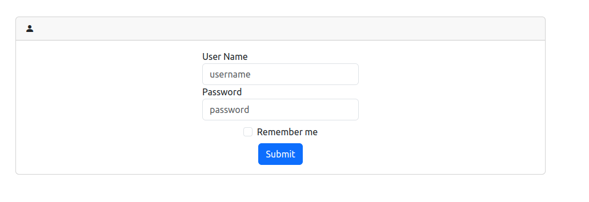

# **BestPractices-WebApp-Security-SpringSecurity**  
  

## **Introduction**  
This repository extends the previous **Spring MVC & Thymeleaf** application by adding **Spring Security** for **authentication and authorization**. It ensures that only authorized users can access sensitive data and perform critical actions.  

## **Features**  
✔️ **User Authentication** – Secure login/logout mechanism  
✔️ **Role-Based Access Control (RBAC)** – Different permissions for users & admins  
✔️ **Secure Password Storage** – Hashing with **BCrypt**  
✔️ **Authorization Filters** – Restricting access to certain pages  
✔️ **Session Management** – Protecting against session hijacking  

## **Technologies Used**  
🔹 **Java 17+**  
🔹 **Spring Boot** (Spring Security, Spring MVC, Spring Data JPA)  
🔹 **Thymeleaf** (for authentication views)  
🔹 **MySQL Database** (for storing data and user credentials)  
🔹 **BCrypt** (for password hashing)  

## **Setup & Installation**  
1️⃣ Clone the repository:  
```sh  
git clone https://github.com/MOHAJII/BestPractices-WebApp-Security-SpringSecurity.git  
cd BestPractices-WebApp-Security-SpringSecurity  
```  

2️⃣ Run the application using Maven:  
```sh  
mvn spring-boot:run  
```  

3️⃣ Open your browser and access:  
```
http://localhost:8085/login
```  
(Default login credentials are stored in the database and can be modified.)  

## **User Roles & Access Control**  
| Role  | Access Rights |
|--------|-----------------------------|
| **USER**  | Can view patient records |
| **ADMIN**  | Can add, edit, delete patients & manage users |

## **Implementation Details**
- **Spring Security Filters** – Handles authentication and authorization  
- **Login & Logout Views** – Built using Thymeleaf  
- **Custom UserDetailsService** – Loads users from the database  
- **CSRF Protection** – Enabled by default for secure request handling  
- **Password Hashing** – Uses **BCrypt** for secure password storage  

## **Upcoming Features**  
📌 The next part in this series will introduce:  
✅ **JWT-based authentication** for stateless security  
✅ **OAuth2 and Social Login integration**  
✅ **Advanced security best practices**  

## **Conclusion**  
This project enhances the previous **Spring MVC & Thymeleaf** application by implementing **Spring Security**, ensuring robust authentication and authorization. It follows best practices for securing web applications and managing user access efficiently.  
