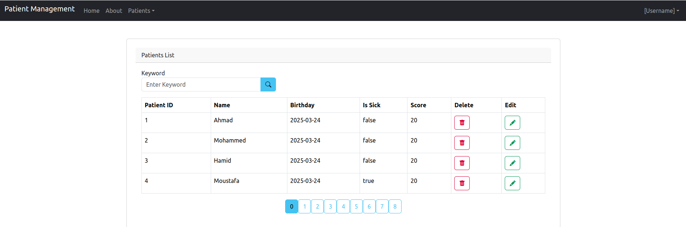

# **BestPractices-WebApp-SpringMVC-Thymeleaf**  

  

## **Introduction**  
This repository is part of the **Best Practices Web Application** series, demonstrating how to build a **Spring Boot web application** using **Spring MVC**, **Thymeleaf**, and **Spring Data JPA**. It focuses on **managing patients** with a clean and maintainable architecture.  

## **Features**  
✔️ **Display Patients** – List all patients in a structured view.  
✔️ **Pagination** – Efficiently navigate through patient records.  
✔️ **Search Functionality** – Find patients dynamically.  
✔️ **Delete Patients** – Remove patient records.  
✔️ **UI Enhancements** – Improved user experience with Thymeleaf.  

## **Technologies Used**  
🔹 **Java 17+**  
🔹 **Spring Boot** (Spring MVC, Spring Data JPA)  
🔹 **Thymeleaf** (for frontend rendering)  
🔹 **H2 Database** (for easy setup)  
🔹 **Bootstrap** (for styling and responsiveness)  

## **Setup & Installation**  
1️⃣ Clone the repository:  
```sh  
git clone https://github.com/MOHAJII/BestPractices-WebApp-Part2-SpringMVC-Thymeleaf.git 
cd SpringMVC-Thymeleaf 
```  
2️⃣ Run the application using Maven:  
```sh  
mvn spring-boot:run  
```  
3️⃣ Open your browser and access:  
```
http://localhost:8085
```  

## **Conclusion**  
This project demonstrates how to integrate **Spring MVC, Thymeleaf, and Spring Data JPA** to build a **modern, full-stack web application**. It follows best practices for web development. 
# BestPractices-WebApp-Part3-Security-SpringSecurity
